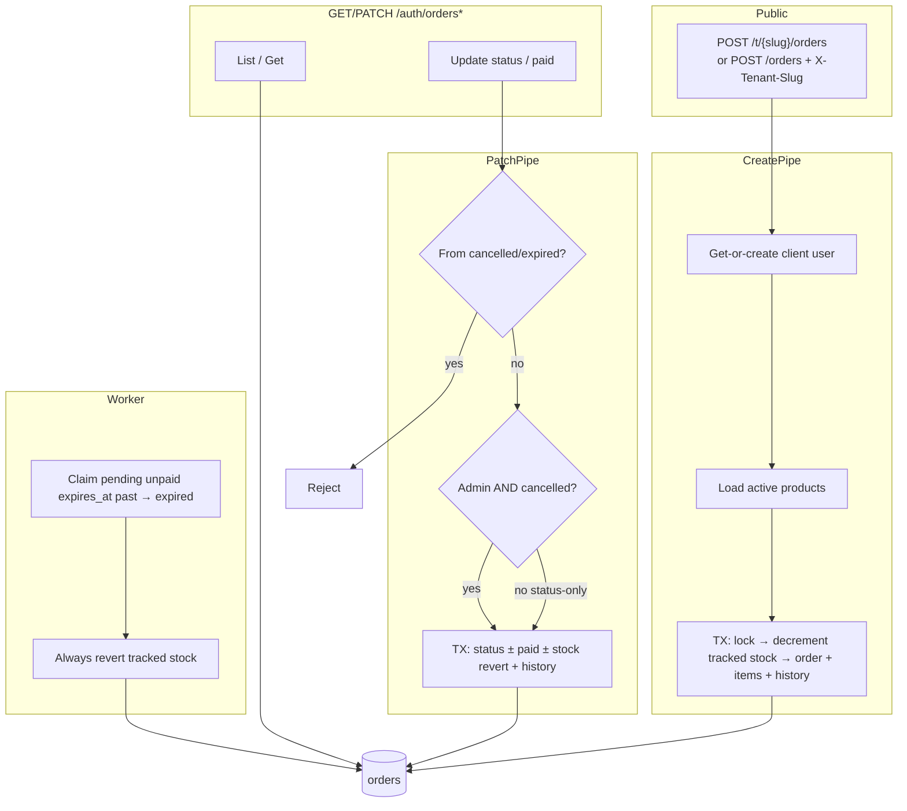
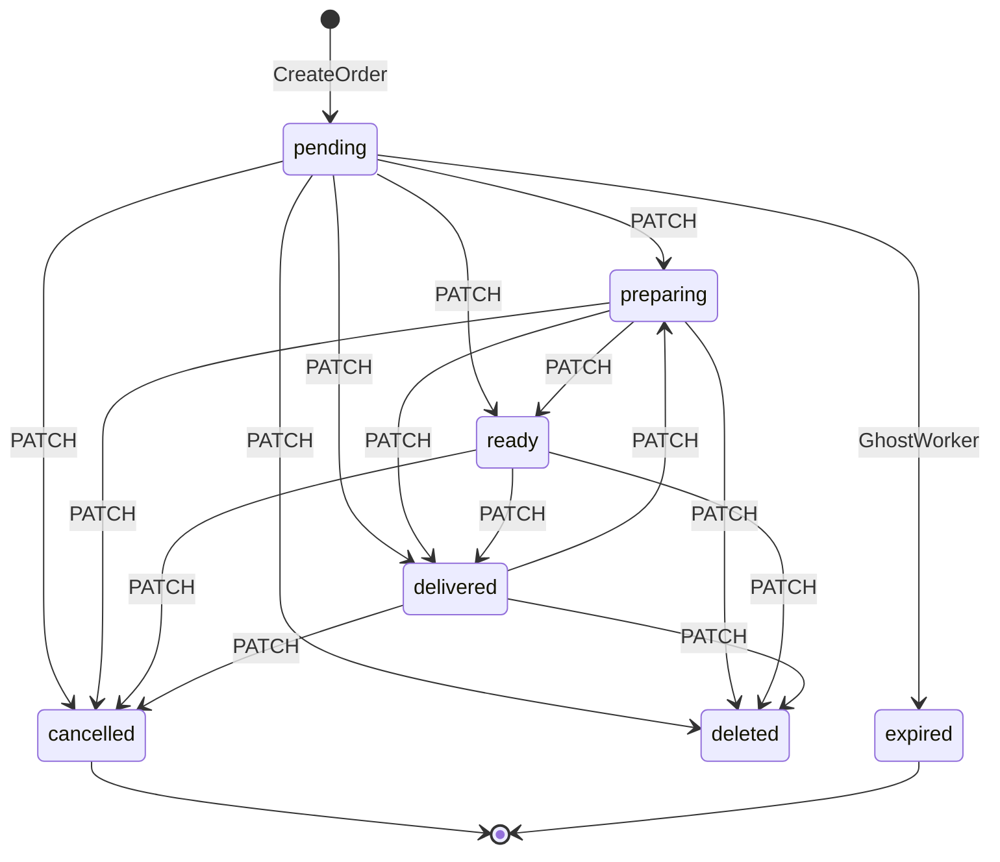

# Orders flow audit + implementation plan

Maps the current orders lifecycle, prioritizes headaches, and records the **locked decisions** for Critical / High hardening (including history write fixes).

**Date context:** post product-flow hardening (`track_inventory`, active-only catalog, admin product gates).

**Status:** decisions locked — ready to implement (sections 11–13). Sections 1–10 remain the pre-fix audit snapshot (“as is today”).

---

## Goals of this audit

Answer, for orders:

1. What does each status / field mean today?
2. What actually gates create, list, update, cancel, expire?
3. Where do stock, auth, and status rules fight each other?
4. What is missing or inconsistent vs what a bakery tenant would expect?
5. What will we change, and why?

---

## Mental model (current)



---

## 1. Endpoints map

| Method | Path | Auth | Tenant | Role gate |
|--------|------|------|--------|-----------|
| `POST` | `/t/{tenant_slug}/orders` | None | Path slug | Public |
| `POST` | `/orders` | None | `X-Tenant-Slug` (legacy) | Public |
| `GET` | `/auth/orders` | JWT | JWT / middleware | **Any role** (not admin-only) |
| `GET` | `/auth/orders/{id}` | JWT | JWT / middleware | **Any role** |
| `PATCH` | `/auth/orders/{id}` | JWT | JWT / middleware | **Any role**; stock restore only if admin/superadmin on cancel |

Contrast with products: product mutations use `RequireAdminRole`. Orders management does **not**.

---

## 2. Order statuses

| Status | How it gets set | Visible in default list? | Stock |
|--------|-----------------|--------------------------|--------|
| `pending` | Create order | Yes | Reserved at create (if `track_inventory`) |
| `preparing` | PATCH | Yes | Unchanged |
| `ready` | PATCH | Yes | Unchanged |
| `delivered` | PATCH | Yes | Unchanged |
| `cancelled` | PATCH | Yes | Reverted **only if** caller is admin/superadmin |
| `expired` | Ghost worker only | Yes | Always reverted by worker |
| `deleted` | PATCH | **No** (unless `ignore_status=true` or `status=` filter) | **Never** reverted |

### Transition rules (actual)

Only these are enforced:

- From `cancelled` → anything: blocked
- From `expired` → anything: blocked
- Everything else: **allowed**

So today these are legal:

- `pending → delivered` (skip kitchen steps)
- `delivered → preparing` (backwards)
- `delivered → cancelled` (admin) → **stock put back after fulfillment**
- `pending → deleted` → **stock stays reserved forever** (unless product is unlimited)

`ErrOrderAlreadyDelivered` exists in errors package but is **unused**.



---

## 3. Happy paths

### Create order

1. Validate payload (name, email, phone, delivery_date, delivery_direction, items).
2. Parse `delivery_date` as `YYYY-MM-DD`; reject if `Before(time.Now())`.
3. Resolve tenant (path or header).
4. Get-or-create **client** user by email (tenant-scoped).
5. Merge duplicate `id_product` lines; load products; require `status == active`.
6. Price total from current product prices; set `expires_at` from tenant ghost timeout (else env / 30 min).
7. TX: lock products → decrement stock when `track_inventory` → insert order (`pending`, `paid=false`) → insert items with **name/price snapshots** → history (`create`, best-effort).
8. Response: **200** `{ "message": "Order created successfully" }` — **no `id_order`**.

Mapped errors:

| Case | HTTP |
|------|------|
| Missing / invalid fields | 400 |
| Product not found | 404 |
| Inactive / deleted product | 409 |
| Not enough stock | 409 |
| Missing tenant | 400 |

### List / get

- Cursor pagination (`created_on ASC, id_order ASC`).
- Filters: `ignore_status`, `status`, `id_user`, `q` (user name/email; numeric also matches `id_order`).
- Default list hides `deleted`.
- Joins items; returns snapshots as `name` / `unit_price`.

### Update (`PATCH`)

Body: at least one of `status`, `paid`; optional `cancellation_reason`.

Allowed PATCH targets: `preparing | ready | delivered | cancelled | deleted`  
(not `pending` or `expired` via API).

- Status (+ optional paid) goes through status updater (TX when stock revert and/or paid).
- Paid-only updates paid flag + history.
- Admin cancel → stock revert; client cancel → status only.

### Ghost / expired unpaid

Background worker (interval from env, default 5 min):

- Per active tenant, claim `pending` + unpaid + `expires_at < now` → `expired`
- Revert tracked stock + write history (`modified_by = 0`, system cancellation reason)

---

## 4. Stock coupling (orders ↔ products)

| Event | Tracked inventory | Unlimited (`track_inventory=false`) |
|-------|-------------------|-------------------------------------|
| Create | Decrement if enough | Skip |
| Admin cancel | Revert qty | No-op |
| Client cancel | **No revert** | N/A |
| Expired worker | Revert qty | No-op |
| Soft-delete order (`deleted`) | **No revert** | N/A |
| Admin cancel from `delivered` | **Still reverts** | No-op |

This is the main inventory headache: reservation at create is clear, but release rules are asymmetric and can overstock or leak stock.

---

## 5. Fields / snapshots

| Field | Role |
|-------|------|
| `total_price` | Sum at create from live prices |
| `product_name_snapshot` / `unit_price_snapshot` | Frozen on line items at create |
| `paid` | Boolean; independent of status in practice |
| `expires_at` | Ghost deadline snapshot |
| `delivery_direction` | Required on create |
| `delivery_date` | Required; date-only |
| `note` | Optional |
| `cancellation_reason` | Optional on cancel |

After create there is **no API** to edit note, delivery date, or delivery direction.

---

## 6. Findings by severity

### Critical

1. **No admin role gate on `/auth/orders*`**  
   Any JWT (including client) can list **all** tenant orders and PATCH status/paid/delete. Products are admin-gated; orders are not.

2. **Admin cancel restores stock even from `delivered`**  
   Weak transition rules + “cancel always reverts for admin” can inflate inventory after fulfillment.

3. **Client cancel does not restore stock**  
   Combined with (1), a client can cancel (or mark deleted) and leave stock reserved — inventory DoS / leak.

### High

4. **`status=deleted` never restores stock**  
   Soft-hiding a pending order permanently locks reserved units (for tracked products).

5. **Public create ignores subscription canceled**  
   Auth management may be blocked, but storefront can still place orders if tenant is “active” at tenant-row level.

6. **Same-day `delivery_date` often rejected**  
   `deliveryDate.Before(time.Now())` compares midnight UTC/local parse vs wall clock → today frequently fails.

7. **OpenAPI incomplete**  
   Documents list mainly; create/get/patch, public routes, and status/stock rules are undocumented or incomplete.

### High (also in scope)

8. **Create response has no `id_order`** (and uses 200 not 201) — FE cannot deep-link or poll the new order easily. **(In scope: return `id_order`, prefer 201.)**
9. **No real status FSM** — kitchen progression is cosmetic; `ErrOrderAlreadyDelivered` unused. **(In scope: linear FSM.)**
10. **History incomplete fields** (elevated) — ghost/cancel history may omit fields such as `delivery_direction`; writes stay best-effort but payloads must be complete. **(In scope.)**

### Medium (out of scope for this pass)

11. **Soft-deleted user + same email** can break reorder (unique email) → opaque failure.
12. **No rate limit** on public create; ghost worker does not run immediately on process start.
13. **Existing customer name/phone** from payload not refreshed on reorder (email match only).
14. **No HTTP API for order history** (repo method exists, no route) — not adding endpoint this pass.

### Low (out of scope for this pass)

15. Dead / legacy helpers (`GetExpiredPendingOrders` by `created_on` vs `expires_at` claim path).
16. JSON `OrderItems` PascalCase vs snake_case elsewhere.
17. Money as `float64`; note length unconstrained in app layer.
18. INNER JOIN on items can hide corrupt itemless orders.

---

## 7. Overlaps / confusing concepts (like products’ available vs status vs stock)

| Concept | Intended job | Actual pain |
|---------|--------------|-------------|
| `paid` | Payment flag | Orthogonal to status; unpaid `delivered` / paid `pending` possible |
| `cancelled` vs `expired` vs `deleted` | Manual cancel / timeout / soft-hide | Three “gone” states with **three different stock behaviors** |
| `pending` reservation | Hold inventory until pay/fulfill | Clear on create; unclear on cancel/delete |
| Client vs admin cancel | Who may cancel; who restores stock | Role checked only for stock restore, not for permission to cancel |

Recommended product-like clarification (discussion only):

- One “release stock” rule: e.g. release on cancel/expire **before** fulfillment; never after `delivered`; never use `deleted` without release or forbid delete while reserved.
- Gate `/auth/orders*` mutations (and probably list) to admin, or scope client to **own** orders only.

---

## 8. Multi-tenant / security summary

| Concern | Status |
|---------|--------|
| Queries scoped by `tenant_id` | OK |
| Cross-tenant product IDs | Rejected via tenant product fetch |
| Inactive tenant on public create | Blocked |
| Role-based order admin | **Missing** |
| Client access to all tenant orders | **Open** |
| Public order create rate limit | **Missing** |
| Subscription canceled vs public orders | **Inconsistent** |

---

## 9. Test coverage (observed)

**Covered well:** create + stock / `track_inventory`, duplicate line merge, list filters/cursor/search, combined PATCH atomicity, admin/superadmin cancel restore, ghost cancel + multi-tenant isolation.

**Gaps:**

| Gap | Why it matters |
|-----|----------------|
| Client JWT listing/updating others’ orders | Authz Critical #1 |
| `delivered → cancelled` stock restore | Critical #2 |
| `pending → deleted` stock leak | High #4 |
| Same-day delivery_date | High #6 |
| Soft-deleted user reorder | Medium #9 |
| Public create + canceled subscription | High #5 |
| Transition matrix / delivered immutability | FSM missing |

---

## 10. File map

| Area | Path |
|------|------|
| Status / models | `model/orders/order.go`, `order_items.go`, `order_history.go` |
| HTTP | `internal/handlers/orders.go` |
| Validators | `internal/handlers/validators/order_validators.go` |
| Create | `internal/services/orders/create.go` |
| Status + stock | `internal/services/orders/update_status.go` |
| Ghost worker | `internal/services/orders/cancel_expired.go` |
| Routes | `cmd/api/main.go` |
| Repo | `internal/repository/orders/order.go` |
| Stock SQL | `internal/repository/products/product.go` |
| OpenAPI | `docs/openapi.yaml` |
| Integration tests | `tests/orders_test.go`, `tests/cancel_expired_orders_test.go` |

---

## 11. Locked decisions (product / API)

Agreed with stakeholders before implementation:

| Topic | Decision | Why |
|--------|----------|-----|
| Who manages `/auth/orders*` | **Admin + superadmin only** | Customers must not list/mutate tenant orders via auth APIs yet; mirrors product admin gating |
| Status workflow | **Linear:** `pending → preparing → ready → delivered` (no skips, no backwards) | Kitchen progression becomes real, not cosmetic |
| Cancel | Only from `pending` \| `preparing` \| `ready`; **forbidden from `delivered`** | After delivery, order is fulfilled; cancel would corrupt inventory if stock were restored |
| Stock restore | On **cancel (pre-delivery)** and on **`expired`**; **never after `delivered`** | Reservation = hold until abandoned or sold; sale at delivery keeps stock decremented |
| Soft-delete (`deleted`) | Allowed **only from** `cancelled` \| `expired` \| `delivered`; **never touches stock** | Delete = hide from default admin lists; stock already resolved in prior status |
| Subscription canceled | **Block** public `POST` create order | Otherwise a tenant could stop paying and keep earning via the storefront |
| Same-day delivery | **Allow today** (compare calendar dates, not `Before(time.Now())` on midnight) | `YYYY-MM-DD` is a date, not an instant; today is a valid delivery day |
| Create response | Return **`id_order`**; prefer **201 Created** | FE can deep-link / confirm the new order |
| History | Keep **best-effort** writes; **fix incomplete fields** (e.g. ghost `delivery_direction`) | Do not fail checkout/status if history insert fails; do make history rows accurate when written |
| History HTTP API | **Not in this pass** | Repo already has read helpers; endpoint can wait |

### Target status + stock diagram

```text
pending → preparing → ready → delivered
   │          │          │
   └──────────┴──────────┴──→ cancelled   (restore tracked stock)
   │
   └──→ expired (ghost worker, pending+unpaid only; restore tracked stock)

cancelled | expired | delivered ──→ deleted   (no stock change; terminal hide)

blocked examples:
  delivered → cancelled
  delivered → preparing
  pending → deleted
  pending → ready   (no skip)
```

### Target stock matrix

| Event | Restore tracked stock? |
|-------|------------------------|
| Create | Decrement (if `track_inventory`) |
| Cancel from `pending` / `preparing` / `ready` | **Yes** |
| Cancel from `delivered` | **N/A — transition forbidden** |
| `expired` (worker) | **Yes** |
| `deleted` (only after cancelled / expired / delivered) | **No** |
| Reach `delivered` | **No** (reservation becomes sale) |

---

## 12. Implementation plan (what we will cover)

Scope = **Critical + High** from the audit, plus history field fixes (elevated to High). Medium/Low items above stay deferred unless they fall out naturally from these changes.

### Work item 1 — Admin-only auth on order management

**What**

- Put `GET /auth/orders`, `GET /auth/orders/{id}`, `PATCH /auth/orders/{id}` behind `RequireAdminRole` (same pattern as `/auth/products*`).
- Reject client JWTs with **403**.

**Why**

- Critical #1 / #3: any authenticated client can today list all tenant orders and PATCH cancel/delete without restoring stock → inventory DoS and data leak.
- Product APIs already require admin; orders must match.

### Work item 2 — Linear status FSM + cancel/delete rules

**What**

- Implement real `validateStatusTransition`:
  - Forward only: `pending → preparing → ready → delivered`
  - `cancelled` only from `pending` \| `preparing` \| `ready`
  - `deleted` only from `cancelled` \| `expired` \| `delivered`
  - From `cancelled` / `expired` / `deleted`: no further status changes
  - Reject backwards moves and skips
- Wire unused / correct error sentinels (`ErrInvalidStatusTransition`, delivered/cancel conflicts as needed).
- Map transition errors to **400** (or existing HTTPError codes).

**Why**

- Critical #2 and High #9: without an FSM, `delivered → cancelled` restores stock after fulfillment, and kitchen status is meaningless.
- High #4: forbidding `pending → deleted` prevents soft-delete from locking reserved stock forever; delete never needs to touch inventory.

### Work item 3 — Stock release aligned with FSM

**What**

- On admin cancel (only possible pre-delivery after Work item 2): revert tracked stock in the same TX as today.
- On ghost `expired`: keep always revert tracked stock.
- On `deleted`: **never** revert (by construction of allowed sources).
- Remove any path that restores stock after `delivered` (blocked by FSM).
- Because clients lose PATCH access (Work item 1), “client cancel without restore” ceases to be a production path.

**Why**

- One coherent reservation model: restore only when the order dies **before** delivery; keep decrement when it completes.

### Work item 4 — Block public create when subscription is canceled

**What**

- On `POST /t/{slug}/orders` and legacy `POST /orders`, reject when tenant subscription is not operable (align with `RequireOperableSubscription` semantics used on `/auth`).
- Clear HTTP error (403/402/409 — pick consistent with existing subscription middleware).

**Why**

- High #5: a canceled tenant could keep taking storefront orders and earning while not paying for the platform.

### Work item 5 — Same-day delivery_date + create response

**What**

- Validate delivery date as **calendar day ≥ today** in the tenant/server local date basis used by the handler (not `parsedMidnight.Before(time.Now())`).
- Create success: **201** + body including `id_order` (keep message).

**Why**

- High #6 / #8: date-only field was rejecting “today”; FE needs the new order id.

### Work item 6 — History write completeness (best-effort)

**What**

- Keep history inserts best-effort (do not fail create/status/expire solely because history failed).
- Fix incomplete history payloads, especially ghost expire path (`delivery_direction` and any other omitted NOT NULL / meaningful fields).
- Ensure cancel/status history snapshots match the order row fields we care about for audit.

**Why**

- Elevated High #10: incomplete history makes support/audit unreliable even if the order itself is correct.

### Work item 7 — Docs for FE + OpenAPI

**What**

- Update `docs/openapi.yaml` for create/get/patch, public routes, status transitions, subscription block, create 201/`id_order`, authz.
- Add `docs/FRONTEND_ORDERS_API_CHANGES.md` (mirror product FE changelog) describing admin-only auth orders, FSM, stock/delete rules, delivery date, create response, subscription block.

**Why**

- High #7: FE and contract must match the new rules or clients keep calling legacy assumptions.

### Work item 8 — Tests (TDD around the above)

**What**

- Unit/integration for:
  - Client JWT → 403 on `/auth/orders*`
  - Linear transitions allowed / skips & backwards rejected
  - `delivered → cancelled` rejected; no stock inflate
  - `pending → deleted` rejected
  - `cancelled|expired|delivered → deleted` allowed; stock unchanged on delete
  - Cancel from pre-delivery restores tracked stock
  - Public create blocked when subscription canceled
  - Same-day delivery accepted
  - Create returns 201 + `id_order`
  - Ghost history includes `delivery_direction` (and related fields)

**Why**

- Lock the Critical/High behavior so regressions do not reopen inventory/auth holes.

---

## 13. Implementation order (PRs / steps)

1. **Authz** — `RequireAdminRole` on `/auth/orders*` + tests  
2. **FSM + stock matrix** — transition validator, cancel/delete rules, stock restore only pre-delivery + expire  
3. **Subscription gate** on public create  
4. **Create UX** — date-only today + `id_order` / 201  
5. **History field fixes** (best-effort)  
6. **OpenAPI + FE changelog**  
7. Full regression on orders + cancel-expired integration tests  

---

## 14. Explicitly out of scope (this pass)

- Client-facing order portal (own-order GET/PATCH)
- New `GET /auth/orders/{id}/history` endpoint
- Soft-deleted user reorder fix
- Rate limiting public create
- Ghost worker immediate run on boot
- Changing money type away from `float64`
- Renaming `OrderItems` JSON to snake_case
- Skipping forward in the kitchen flow (linear only)

---

## 15. Bottom line

**Today:** tenant scoping is real; role gating is not; stock release and status fight each other.

**After this plan:** only admins manage orders; status is a real linear workflow; stock restores only when an order is abandoned before delivery; delete only hides terminal orders and never touches stock; canceled subscriptions cannot take new storefront orders; create is usable for FE (`id_order`, today allowed); history stays best-effort but complete when written.
